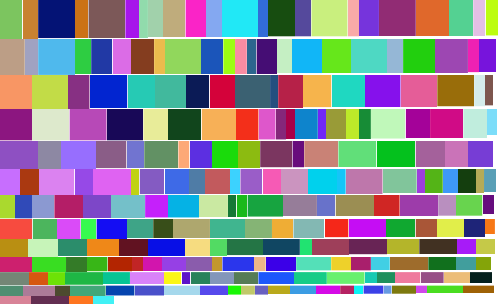

# Moony-TexturePacker
A simple tool that packs multiple images into single texture atlas for use with Moony-Engine and Moony-SpriteBatch.

## Introduction
This tool packs image files into larger image maps known as texture atlases. Though this software isn't as sophisticated as others (concave polygon packing) it gets the job done and even has some neat features. It implements a bin-packing algorithm using binary spacial partitioning. It can produce compressed moony texture pack files (`.mtpf`) if you built it with the `USE_ZLIB` flag and linked the zlib library.

This software was designed to be used with either with Moony-SpriteBatch or SFML directly but is easy enough to understand that it can be modified to work within any pipeline.

## How to build
There is only one file that needs to be built and that is TexturePacker.cpp. When building you need to point your compiler to where you installed SFML. If you do not set the `USE_ZLIB` flag you don't need to worry about building and linking zlib.

If you are on windows and use Visual Studio open a `Developer Command Prompt` and enter this:

Change your directory to the source directory
>cd C:/path/to/source

Compile and link the source code
>cl /I C:/path/to/SFML/include C:/path/to/SFML/lib/sfml-system.lib C:/path/to/SFML/lib/sfml-window.lib C:/path/to/SFML/lib/sfml-graphics.lib TexturePacker.cpp

The code should compile and produce TexturePacker.exe.

If you want to build with zlib feature do this:
>cl /D USE_ZLIB /I C:/path/to/SFML/include /I C:/path/to/zlib/include C:/path/to/SFML/lib/sfml-system.lib C:/path/to/SFML/lib/sfml-window.lib C:/path/to/SFML/lib/sfml-graphics.lib C:/path/to/zlib/lib/zlib.lib TexturePacker.cpp

You can also change out the names with debug versions of the libraries if you'd like. Remember that you must put `sfml-system-2.dll`, `sfml-window-2.dll`, `sfml-graphics-2.dll` and `zlib.dll` with the executable in order for it to run. If you want to link statically it's essentially the same thing but using the `/MT` flag, though I haven't tried it..

If you are using GCC or MinGW open a `Command Prompt` or `Terminal` and enter this:

Change your directory to the source directory
>cd C:/path/to/source

Compile and link the source code
>g++ TexturePacker.cpp -I C:/path/to/SFML/include -L C:/path/to/SFML/lib -lsfml-graphics -lsfml-window -lsfml-system -s -O2 -o TexturePacker.exe

And if you want to build with zlib:
>g++ TexturePacker.cpp -D USE_ZLIB -I C:/path/to/SFML/include -I C:/path/to/zlib/include -L C:/path/to/SFML/lib -lsfml-graphics -lsfml-window -lsfml-system -L C:/path/to/zlib/lib -lzlib -s -O2 -o TexturePacker.exe

__Note!__ I don't know if this needs saying but use your own directories. C:/path/to/SFML is not a real directory, just an example. Just in case..

## How to use
Once built you can drop the tool in any directory you want but it is most useful when used from the commandline. When you run it without any args by default it will sniff around it's current directory for any images to pack. Texture pack files are named after the folder they were created in and texture pack images begin with _ta_[`NUMBER`][`FOLDER`].png, for instance: _ta_0Textures.png.

These are the options available by running the tool from the commandline.

Command | Function
---|---
`-h` | Prints a help message with the list of options
`-b` | Tells the tool not to produce seperate atlas image files but rather compress the raw color data and pack everything into the .mtpf texture pack file (requires the building with USE_ZLIB defined)
`-f [PATH]` | Designate a folder you specifically want the tool to work in
`-r` | Recursivley search through all directories under the starting directory. This can be used together with the -f flag
`-d [NUM]` | Produce `[NUM]` # of debug textures.
`-v` | Outputs more messages.

Once the tool is done packing it will produce a .mtpf file that you can parse using the Moony-SpriteBatch TextureAtlas class. If you didn't use the -b flag (or couldn't because you didn't build with USE_ZLIB) you will get an additional .png file(s). These images need to be in the same directory with the .mtpf file because they are referenced inside the file and are necessary for correctly deserializing the texture pack file.
